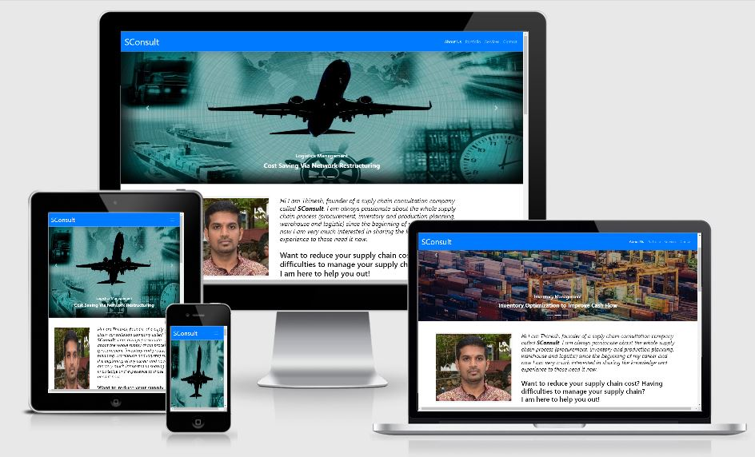
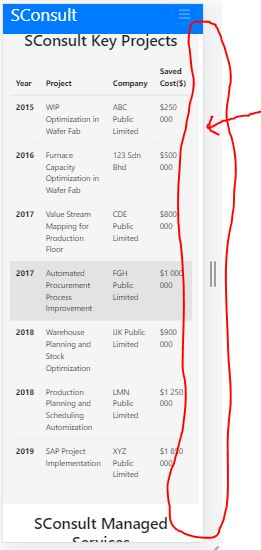
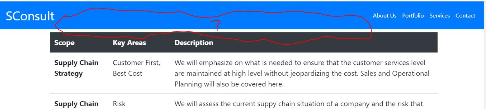

# **SConsult** - A Supply Chain Consultation Company

This site is an informative site, providing an opportunity for me to share and develop the knowledge of supply chain into a profitable business for both parties, SConsult and the customers.
The goal of crating this website is to attract any companies that are looking to save some money without jeopardizing the quality of service or products by showcasing SConsult's past projects and achievements.
 
## UX

The focus of this website to provide adequate information for anyone looking forward to resolve any supply chain related issue.

### User Stories

- As a client who is looking for a reputable and competent person/company that can handle a project to reduce the cost for us.

- As a business owner, I am looking for a guy who have experience handling variety of industrial and supply chain projects to visualize the oppurtunity of cost optimizing where ever possible.

- As a General Manager/Managing Director of a manufacturing plant, I would look for an expert in cost optimization field especially in supply chain field with a strong past projects portfolio to hire to improve the cash flow of my company by controlling spending of the company.

### Design Process

In the process of designing this website, I started to draft the layouts by hand (https://github.com/Thineshsoundrajan/MS1/tree/master/drafts) and transferring them wireframes (https://github.com/Thineshsoundrajan/MS1/blob/master/wireframes/wireframes%20MS1.pdf) before start to build the website in Gitpod.

## Features

### Existing Features

- **Home page** - Starting with the navigation bar consist of the company name, SConsult and the menu items. Clicking on the company name will always direct back to the home page. Added with a carousel picture visualizing multiple images as a representation on the area of expertise of SConsult with captions(not in the mobile view).

- **About Us** - A brief introduction about the company, SConsult and myself.

- **Portfolio** - Showcase SConsult performance in term of number of projects and the cost that SConsult manage to save for the client that we served for the past 5 years. In this section also few key projects that will catch eye of the viewer has been highlighted.

- **Services** - All the services that SConsult offering to the pontential client are being listed out here in this section.

- **Contact** - An email form to send a project request to SConsult with options provided by narrowing the scope of each individual request.

### Additional Features to be Implement in Future

- **Vision,Mission & Organization Sturcture** - This section should be a sub section to the About Us section.

- **List of Client** - This section should be a sub section to the Portfolio section.

### Features Left to Implement

- **Personal Professional Experiences** - This section will showcase my personal experiance in the supply chain field before I jump into consultation business.

## Technologies Used

In this section, you should mention all of the languages, frameworks, libraries, and any other tools that you have used to construct this project. For each, provide its name, a link to its official site and a short sentence of why it was used.

- [HTML5](https://www.w3schools.com/html/)
    - The project uses **HTML5** to construct all the sections in this website.

- [CSS3](https://www.w3schools.com/css/default.asp)
    - The project uses **CSS3** to style all the element in this project in term of font size, color spacing and etc.

- [Bootstrap](https://getbootstrap.com/)
    - The project uses **Bootstrap** for all the responsive layout used in this project which includes responsive image, tables and forms.

- [Github](https://www.gitpod.io/)
    - The project uses **Github** as a platform to build this project where the project is stored and allow to deploy this website using Github pages.

- [Gitpod](https://www.gitpod.io/)
    - The project uses **Gitpod** to write and save the code for this website development.

- [Chrome DevTools](https://developers.google.com/web/tools/chrome-devtools)
    - The project uses **Chrome DevTools** to test the codes that was written in this project.

- [W3C Markup Validation Service](https://validator.w3.org/#validate_by_input)
    - The project uses **W3C Markup Validation Service** to validate the HTML codes written in this project.

- [W3C CSS Validation Service](http://jigsaw.w3.org/css-validator/)
    - The project uses **W3C CSS Validation Service** to validate the CSS codes written in this project.

## Testing

1. [Am I Responsive](http://jigsaw.w3.org/css-validator/) website has been used to test the website responsiveness in various and devices.

2. Desktop: This website has been tested in Google Chrome, Microsoft Edge and Mozilla Firefox browsers where all links to the pages, responsive table and forms and the footer icons are working well.

3. Mobile: This website has been tested in mobile phone (Samsung Galaxy A8+) where all links to the pages, responsive table and forms and the footer icons are working well. I also tested mobile responsiveness in other models of handphones by using options that is available in Chrome DevTools.

4. I have tested if the website are serving the purpose of the creation by gathering opinions from family, friends and my mentor.

5. Contact form:
    1. Go to the "Contact" page.
    2. Try to submit the empty form and there is a message appeared as "Please fill out this field" which prevent client from submitting empty form.
    3. Try to submit the form with a proper email address syntax and there is a message appeared as "Please include an @ in the email address".
    4. Try to submit the form with all inputs valid and the submit button works by redirecting back to home page for this project as the submit button was not linked to any server for the moment.

6. Unsolved Issues: Unable to settle it before submission due to the time constraint to figure out the solution.

    1. The width of header element does not align with the sections and footer which create the white spacing for the sections and footers.

    

    2. When I clicked on the nav item on the section that I want to view, it does not direct me to the header of the section but to the content directly which is not the way I want it to be.

    

## Deployment

1. Firstly, I created a Github account at (https://github.com/) which then give an access for me to create a repository under my own at (https://github.com/Thineshsoundrajan).

2. Then, I created a repository for this project at this url;(https://github.com/Thineshsoundrajan/MS1) in which I push all the file of codes that was created in Gitpod.

3. In order to publish this project on the web, I need to go to my repository, went to the Settings tab and scrolled down to the Github Pages section. Then, under the Source setting, I selected master branch from the dropdown menu that was available and saved it.

4. Finally, the url for the this project;(https://thineshsoundrajan.github.io/MS1/) was given by Github to be published.

## Credits

### Content

- The code for the tables was copied from [Bootstrap Tables](https://getbootstrap.com/docs/4.4/content/tables/).

- The code for the forms was copied from [Bootstrap Forms](https://getbootstrap.com/docs/4.4/components/forms/).

- The code for the navigation bars was copied from [Bootstrap Navbar](https://getbootstrap.com/docs/4.4/components/navbar/).

- The code for the carousel image was copied from [Bootstrap Carausel](https://getbootstrap.com/docs/4.4/components/carousel/).

- The code to apply filter to the carousel image was referred from [w3schools.com](https://www.w3schools.com/howto/howto_css_image_effects.asp).

- The template to start this site was copied from [Code-Institute-Org/gitpod-full-template](https://github.com/Code-Institute-Org/gitpod-full-template).

- The template for README.md file was copied from [Code-Institute-Solutions/readme-template](https://github.com/Code-Institute-Solutions/readme-template).

### Media

- The photos used in this site were obtained from :

    - conttenna.jpg image from (https://unsplash.com/photos/xewrfLD8emE).

    - industrial.jpg image from (https://unsplash.com/photos/wnOJ83k8r4w).

    - airplane.jpg image from (https://freerangestock.com/photos/39523/global-logistics-and-freight-concept.html).

    - DSC_6470.jpg is my own picture.

    - graph.jpg was created on my own using [WPS Spreadsheet](https://www.wps.com/spreadsheets) and later converting it to picture.

- The social link icon used in this site were obtained from :

    - (https://fontawesome.com/)

- Paint application from Microsoft was used to resize all the images used in this website.

### Acknowledgements

- My mentor, Mr. Adegbenga Adeye for all his advice, enlightment on the Bootstrap usage and  pushing me to improve the layout of the website itself.

- My wife, Kasturi Rajendran and my friend Partiban Ganesh for their opinions on the outcome of the website.
